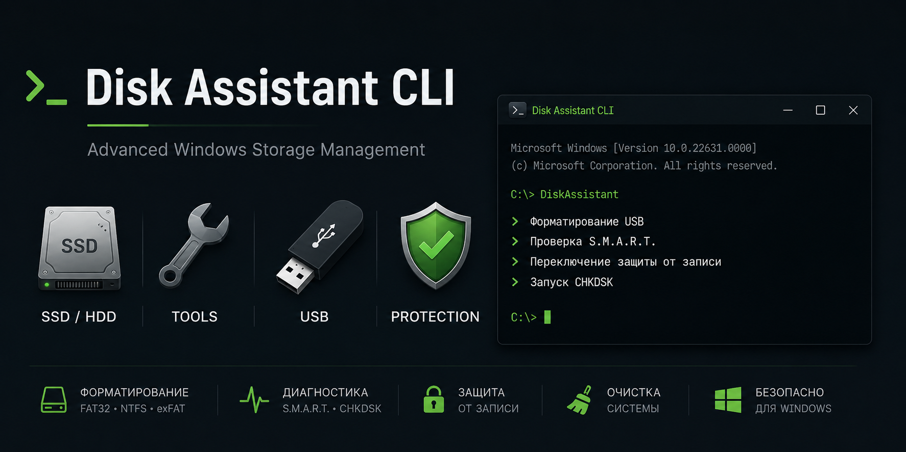

# Disk Assistant CLI

> Powerful Windows command-line utility for disk management, diagnostics, maintenance, and storage protection.



## Overview

Disk Assistant CLI is an interactive Windows command-line toolkit designed to simplify common disk management and maintenance tasks. Built with batch scripting, it provides a convenient and user-friendly interface for managing storage devices directly from the terminal.

The tool allows users to format USB drives, securely erase internal disks, monitor drive health, manage write protection, run CHKDSK scans, and perform basic system cleanup operations — all from a single interface.

## Features

* Format USB drives (**FAT32**, **NTFS**, **exFAT**)
* Erase and clean internal **HDDs** and **SSDs**
* Monitor drive health using **S.M.A.R.T. diagnostics**
* Built-in **CHKDSK** integration
* Enable or disable disk **write protection**
* Remove temporary files and perform quick system cleanup
* Prevent accidental operations on the system drive
* Bilingual interface (**English / Russian**)
* Includes **WinRE** instructions for complete disk wiping

## Requirements

* Windows 10 / Windows 11
* Administrator privileges
* Command Prompt (CMD)

## Usage

1. Download the latest release or clone the repository.
2. Run `Disk Assistant CLI_v1.bat` as **Administrator**.
3. Follow the on-screen instructions.

```bat
Disk Assistant CLI_v1.bat
```

## Warning

> ⚠️ Some operations are destructive and cannot be undone.
>
> Always verify the selected disk before proceeding.

## Project Structure

```text
.
├── Assets/
├── Disk Assistant CLI_v1.bat
├── README.md
└── LICENSE
```

## Contributing

Contributions, bug reports, and feature requests are welcome.

Feel free to open an issue or submit a pull request.

## License

This project is licensed under the MIT License.
